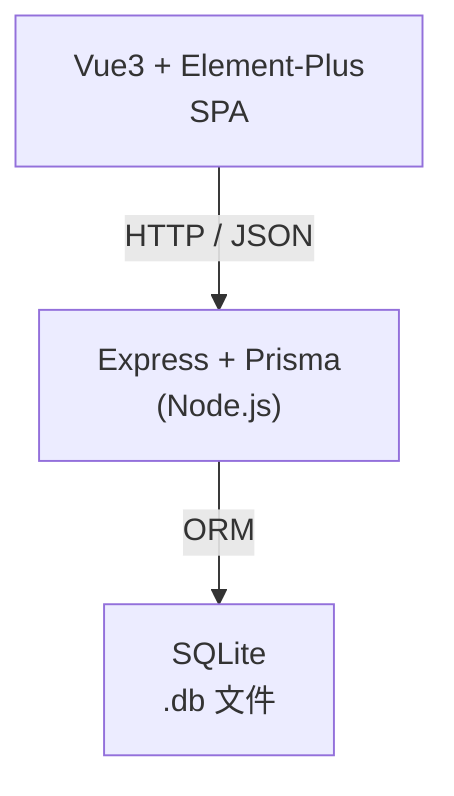

# 🍃 Node.js 「茶叶仓储管理系统」设计方案   


---

## 0. 读图导航



---

## 1. 目标与范围

1. 必做  
   • 茶叶档案：详细信息录入、修改、筛选  
   • 入库单：整单新增（多行明细）、查询  
   • 出库单：校验库存后新增、查询  
   • 库存查询：实时结算各茶叶可用量  
2. 可选（留扩展位）  
   • 简单登录（JWT）、条码打印、Excel 导入导出  

---

## 2. 技术栈一览

| 层级 | 技术 | 理由 |
|------|------|------|
| 前端 | Vue 3 + Vite + Element-Plus + Pinia + Axios | 快、轻、生态佳 |
| 后端 | Node 18 + Express + TypeScript | 学习曲线低 |
| ORM  | Prisma | 单文件 SQLite & 以后迁移到 MySQL 都 OK |
| DB   | SQLite | 嵌入式零运维 |
| 构建 | pnpm / npm | 二选一 |
| 开发脚手架 | nodemon + ts-node-dev | 热更新 |

---

## 3. 功能&页面结构

| 菜单 | 主要页面 | 关键交互 |
|------|----------|----------|
| Dashboard | 看板 (后期) | 今日入库 / 出库 / 库存预警 |
| 茶叶档案 | 列表、编辑弹窗 | 多条件搜索、图片上传 |
| 入库管理 | 入库单列表、入库单新增 | 行内增删茶叶 + 数量 |
| 出库管理 | 出库单列表、出库单新增 | 实时校验可出量 |
| 库存查询 | 所有茶叶库存表 | 导出 CSV（可选） |

目录示例  
```
web/src/pages/
├─ tea/
│   ├─ TeaList.vue
│   └─ TeaForm.vue
├─ inbound/
│   ├─ InList.vue
│   └─ InForm.vue
...
```

---

## 4. 数据模型（ER & Prisma）

### 4.1 ER 简图
```
Tea 1─∞ InboundItem ∞─1 Inbound
Tea 1─∞ OutboundItem ∞─1 Outbound
```
库存通过公式动态计算，不建物理表。

### 4.2 `schema.prisma`

```prisma
datasource db {
  provider = "sqlite"
  url      = "file:./dev.db"
}

generator client {
  provider = "prisma-client-js"
}

enum TeaCategory {
  GREEN
  BLACK
  OOLONG
  WHITE
  DARK
  YELLOW
  HERBAL
}

model Tea {
  id                 Int       @id @default(autoincrement())
  code               String    @unique
  nameCN             String
  nameEN             String?
  category           TeaCategory
  grade              String?
  originProvince     String?
  originRegion       String?
  cultivar           String?
  pickingDate        DateTime?
  batchNo            String?
  moisture           Float?
  caffeine           Float?
  aromaNote          String?
  flavorNote         String?
  recommendedBrewing String?
  shelfLifeDays      Int
  storageTempMin     Float?
  storageTempMax     Float?
  packageSpec        String?
  supplier           String?
  purchasePrice      Decimal?  @db.Decimal(10,2)
  retailPrice        Decimal?  @db.Decimal(10,2)
  imageUrl           String?
  isOrganic          Boolean   @default(false)
  remark             String?
  createdAt          DateTime  @default(now())

  inbounds           InboundItem[]
  outbounds          OutboundItem[]
}

model Inbound {
  id        Int       @id @default(autoincrement())
  code      String    @unique
  createdAt DateTime  @default(now())
  items     InboundItem[]
}

model InboundItem {
  id        Int     @id @default(autoincrement())
  teaId     Int
  qty       Int
  inboundId Int
  Tea       Tea     @relation(fields: [teaId], references: [id])
  Inbound   Inbound @relation(fields: [inboundId], references: [id])
}

model Outbound {
  id        Int       @id @default(autoincrement())
  code      String    @unique
  createdAt DateTime  @default(now())
  items     OutboundItem[]
}

model OutboundItem {
  id         Int      @id @default(autoincrement())
  teaId      Int
  qty        Int
  outboundId Int
  Tea        Tea      @relation(fields: [teaId], references: [id])
  Outbound   Outbound @relation(fields: [outboundId], references: [id])
}
```

---

## 5. API 设计

| 模块 | Method & Path | 描述 |
|------|---------------|------|
| 茶叶 | GET /api/teas?keyword&category… | 列表&筛选 |
| | GET /api/teas/:id | 详情 |
| | POST /api/teas | 新增 |
| | PUT /api/teas/:id | 修改 |
| | DELETE /api/teas/:id | 删除 |
| | POST /api/upload | 图片上传 (multer) |
| 入库 | GET /api/inbounds | 列表 |
| | POST /api/inbounds | 新建（含 items 数组） |
| 出库 | GET /api/outbounds | 列表 |
| | POST /api/outbounds | 新建（含校库存） |
| 库存 | GET /api/stocks | 返回 [{tea, stock}] |

全部返回 JSON，统一结构示例  

```jsonc
{
  "code": 0,
  "msg": "ok",
  "data": { ... }
}
```

---

## 6. 后端项目结构 & 核心代码

```
server/
├─ src/
│  ├─ controllers/
│  │    tea.controller.ts
│  │    inbound.controller.ts
│  │    outbound.controller.ts
│  ├─ services/
│  │    tea.service.ts
│  │    stock.service.ts
│  ├─ middlewares/response.ts
│  ├─ prisma.ts           // PrismaClient 单例
│  └─ index.ts            // 入口
└─ package.json
```

### 6.1 Stock 计算 Service

```ts
// src/services/stock.service.ts
import prisma from '../prisma';

export const calcStocks = async () => {
  const inSum = await prisma.inboundItem.groupBy({
    by: ['teaId'],
    _sum: { qty: true },
  });
  const outSum = await prisma.outboundItem.groupBy({
    by: ['teaId'],
    _sum: { qty: true },
  });

  const inMap  = Object.fromEntries(inSum.map(i => [i.teaId, i._sum.qty ?? 0]));
  const outMap = Object.fromEntries(outSum.map(o => [o.teaId, o._sum.qty ?? 0]));

  const teas = await prisma.tea.findMany();
  return teas.map(t => ({
    ...t,
    stock: (inMap[t.id] || 0) - (outMap[t.id] || 0)
  }));
};
```

### 6.2 出库校验

```ts
export const createOutbound = async (dto: { items: {teaId:number; qty:number}[] })=>{
  const stocks = await calcStocks();
  dto.items.forEach(it=>{
    const s = stocks.find(x=>x.id===it.teaId)?.stock || 0;
    if(it.qty> s) throw new Error(`茶叶ID ${it.teaId} 库存不足`);
  });
  return prisma.outbound.create({
    data:{
      code: `OUT${Date.now()}`,
      items:{ create: dto.items }
    },
    include:{ items:true }
  });
};
```

---

## 7. 前端实现要点

```
web/
├─ src/
│  ├─ api/axios.ts
│  ├─ stores/
│  ├─ router/
│  ├─ pages/
│  │   ├─ tea/
│  │   ├─ inbound/
│  │   ├─ outbound/
│  │   └─ stock/
│  └─ components/
```

### 7.1 茶叶列表示例 (`TeaList.vue`)

```vue
<template>
  <el-card>
    <div class="toolbar">
      <el-input v-model="keyword" placeholder="关键词…" style="width:200px" />
      <el-select v-model="category" placeholder="分类" clearable>
        <el-option v-for="c in dict" :key="c" :label="c" :value="c"/>
      </el-select>
      <el-button type="primary" @click="load">查询</el-button>
      <el-button @click="openEdit()">新增</el-button>
    </div>

    <el-table :data="list" stripe height="600">
      <el-table-column prop="code" label="货号"/>
      <el-table-column prop="nameCN" label="名称"/>
      <el-table-column prop="category" label="分类"/>
      <el-table-column prop="grade" label="等级"/>
      <el-table-column prop="originProvince" label="产地"/>
      <el-table-column label="图片">
        <template #default="{row}">
          
        </template>
      </el-table-column>
      <el-table-column fixed="right" label="操作">
        <template #default="{row}">
          <el-button link @click="openEdit(row)">编辑</el-button>
          <el-button link type="danger" @click="del(row.id)">删</el-button>
        </template>
      </el-table-column>
    </el-table>
  </el-card>

  <TeaForm v-if="dialogVisible" :record="current" @success="load" @close="dialogVisible=false"/>
</template>
```

其他页面（入库、出库）做法类似，只需在表单里嵌套 `el-table` 行编辑即可。

---

## 8. 部署 & 运行

1. 克隆项目  
   ```bash
   git clone xxx tea-wh
   ```
2. 安装依赖  
   ```bash
   cd server && npm i
   cd ../web && npm i
   ```
3. 初始化数据库  
   ```bash
   cd ../server
   npx prisma migrate dev --name init
   ```
4. 启动开发  
   ```bash
   # 后端
   npm run dev
   # 前端
   cd ../web && npm run dev
   ```
5. 访问 `http://localhost:5173` 🎉  

生产模式：`npm run build`（前端 `vite build`）→ 静态文件丢到 nginx；后端 `tsc && node dist`.

---

## 9. 扩展路线图

| 阶段 | 方向 | 说明 |
|------|------|------|
| v1.1 | 登录 & RBAC | 加 `User` 表、bcrypt、JWT 中间件 |
| v1.2 | 报表统计 | Prisma SQL 聚合 + ECharts |
| v1.3 | 盘点/调账 | 新表 `Stocktaking`、行差异 |
| v1.4 | 多仓库 | `warehouse_id` 字段、筛选 |
| v2.0 | 上云 | 数据库换 MySQL / Postgres；Docker Compose 部署 |

---

## 10. 总结

• 采用 **Vue3 + Express + Prisma + SQLite** 达到“极低运维 + 足够完备”的平衡。  
• 茶叶档案字段覆盖产地、化学指标、冲泡建议等，满足专业场景。  
• 入/出库与库存校验逻辑集中在后端 Service，可随时加事务、锁或消息队列。  
• 单体结构清晰易学，未来迁移微服务或 Serverless 几乎无痛。  

